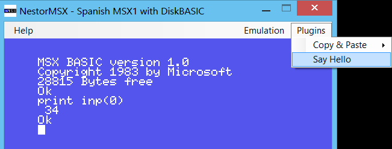

# NestorMSX plugin development guide #

Anyone capable of programming in the .NET platform can develop plugins for NestorMSX. This guide explains how.


## The hello world plugin ##

Let's start with a small tutorial in which we'll build a very simple plugin from scratch. This tutorial assumes that you have Visual Studio and will use C#, but any development environment with support for NuGet and any .NET language are actually fine to develop plugins.

1) Open Visual Studio and create a new solution of type "Class Library". Name it `HelloWorldPluginForNestorMSX`.

2) Add a reference to the `System.Windows.Forms` assembly. (Note: this is not required for all plugins, only for those having its own UI)

3) Install the `NestorMSX.Infrastructure` NuGet package.

4) Add the `HelloWorldPlugin` class with this code:

```
using Konamiman.NestorMSX;
using System.Collections.Generic;
using System.Diagnostics;
using Konamiman.NestorMSX.Menus;
using Konamiman.NestorMSX.Misc;
using System.Windows.Forms;
using Konamiman.Z80dotNet;

namespace HelloWorldPluginForNestorMSX
{
    [NestorMSXPlugin("Hello World")]
    public class HelloWorldPlugin
    {
        public HelloWorldPlugin(PluginContext context, IDictionary<string, object> pluginConfig)
        {
            var message = pluginConfig.GetValueOrDefault("message", "Hello world!");
            context.SetMenuEntry(this, new MenuEntry("Say Hello", () => MessageBox.Show(message)));

            context.Cpu.MemoryAccess += (sender, args) =>
            {
                if(args.EventType == MemoryAccessEventType.BeforePortRead && args.Address == 0)
                {
                    Debug.WriteLine("Port 0 read was requested!");
                    args.CancelMemoryAccess = true;
                    args.Value = 34;
                }
            };
        }
    }
}
```

5) Compile the project in debug mode. Copy the resulting .dll and .pdb files to the _plugins_ directory of NestorMSX.

6) Open the `machine.config` file of the _machines/Spanish MSX1 with DiskBASIC_ directory (actually any machine would do) and add the following inside the `plugins` section:

```
"Hello World": {  }
```

7) Run NestorMSX as the machine where you have configured the plugin (use the menu entry to select the machine or just run this from the command line: `NestorMSX machine="Spanish MSX1 with DiskBASIC"`).

8) Open the _Plugins_ menu. You will see a _Say Hello_ entry, click it and you will be greeted with a "Hello world!" dialog.

9) Go to the BASIC prompt if you aren't already, and execute the following: `print inp(0)`. You should get the value 34.



10) Modify the plugin entry in `machine.config` so that it is as follows:

```
"Hello World": { "message": "Yadda!" }
```

11) Restart NestorMSX (restart the whole emulator, don't just reset the MSX!). Select the _Say Hello_ menu entry again, and see how the message in the dialog is now "Yadda!".


### Debugging ###

12) Close NestorMSX. Return to Visual Studio and set breakpoints in lines 16 (`var message=...`) and 23 (`Debug.WriteLine...`) of the plugin class.

13) Run NestorMSX from command line as follows: `NestorMSX wd`. See how a new console window opens and NestorMSX doesn't start yet.

14) Select _Debug - Attach to process_ in Visual Studio. Search the NestorMSX process by name or by PID (indicated in the console window).

15) Notice how the first breakpoint is hit. Tell Visual Studio to continue execution.

16) Execute `print inp(0)` from the BASIC prompt. Notice how the second breakpoint is hit.

17) Tell Visual Studio to continue execution. Notice how the "Port 0 read was requested!" message appears in the console.

